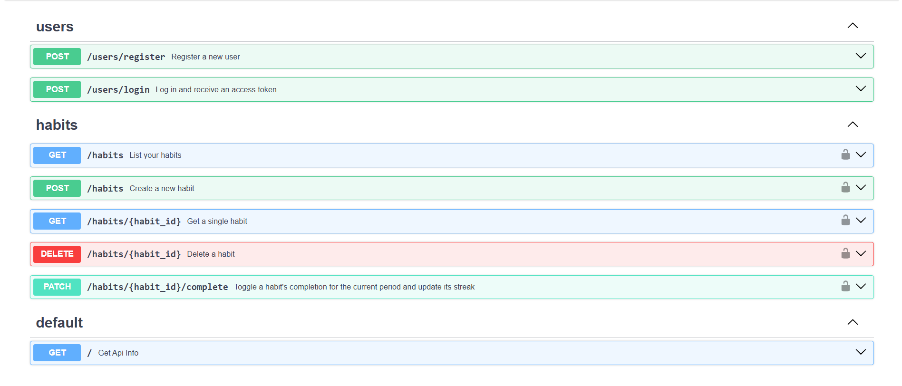

# Habit Tracker API


A backend API for tracking personal habits. Users register and log in with JWT-based authentication, then create, list, view, complete, and delete their own habits — each user can only see and manage habits they own. Completing a habit tracks a streak, based on the habit's frequency (daily, weekly, monthly, or yearly).

**Live API:** https://habit-tracker-api-8zgs.onrender.com/ — interactive docs at [/docs](https://habit-tracker-api-8zgs.onrender.com/docs)

**Frontend:** [habit-tracker-web](https://habit-tracker-web-alpha.vercel.app/), a companion app that consumes this API.

## Tech Stack

- **FastAPI** — web framework and routing
- **SQLAlchemy** — ORM / database models
- **SQLite** — database
- **JWT auth** — via `python-jose` and `passlib` (bcrypt password hashing)
- **pytest** — testing

## Setup

From a fresh clone:

```bash
# 1. Create and activate a virtual environment
python -m venv venv
source venv/bin/activate       # Windows: venv\Scripts\activate

# 2. Install dependencies
pip install -r requirements.txt

# 3. Set up environment variables
cp .env.example .env
# then open .env and set SECRET_KEY to a real secret value

# 4. Run the server
uvicorn main:app --reload
```

The API will be available at `http://127.0.0.1:8000`.

## Running Tests

```bash
pytest -v
```

## Endpoints

Full interactive docs (Swagger UI) are available at `/docs` once the server is running.



| Method | Path                          | Description                                          |
|--------|-------------------------------|-------------------------------------------------------|
| GET    | `/`                           | API info                                              |
| POST   | `/users/register`             | Register a new user                                   |
| POST   | `/users/login`                | Log in and receive a JWT access token                 |
| POST   | `/habits`                     | Create a new habit                                    |
| GET    | `/habits`                     | List your habits                                      |
| GET    | `/habits/{habit_id}`          | Get a single habit                                    |
| PATCH  | `/habits/{habit_id}/complete` | Toggle completion for the current period, updates streak |
| DELETE | `/habits/{habit_id}`          | Delete a habit                                        |

All `/habits` endpoints require a valid JWT access token (obtained via `/users/login`) sent as a Bearer token.

A habit's `frequency` is one of `daily`, `weekly`, `monthly`, or `yearly`. This determines what counts as the "current period" for `PATCH /habits/{habit_id}/complete`: e.g. for a `weekly` habit, completing it once anywhere in the ISO week satisfies that week, and the streak only continues if the previous completion fell in the immediately preceding period (day/week/month/year).

## Notes on Persistence

This project uses SQLite (`habits.db`) for simplicity. If deployed on a host with an ephemeral filesystem (e.g. Render's free tier), the database file can be wiped on redeploy or restart, losing all data. For production use, migrate to a persistent database like PostgreSQL.

## Known Limitations

- **Streak day boundaries use server time.** Completion periods are computed from `date.today()` on the server, which runs in UTC on Render. A user's "day" therefore rolls over at UTC midnight rather than their own local midnight, so a completion made late at night in some timezones could land in the "wrong" day or week. Fine for now; a proper fix would take the user's timezone into account.